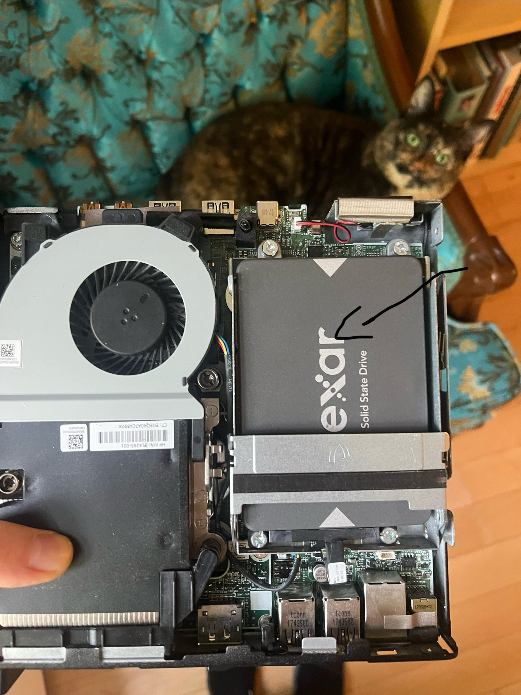

= 03 • Installing Proxmox VE 8.4 on the HP EliteDesk 800 G3 Mini
:toc:
:icons: font

This page records the steps and fixes to install Proxmox on the refurbished HP EliteDesk 800 G3 Mini.  
The main issue was that the SSD wasn’t being recognized because it was loose, so I opened the case and re-seated it (see in troubleshooting)

toc::[]

== 1 • Prerequisites

[cols="1h,3"]
|===
|Item |Notes

|Download Proxmox ISO
|`proxmox-ve_8.4-1.iso` (≈1 GB)  
https://proxmox.com/en/downloads

|Flashing tool
|Used **Rufus** to write the ISO → 8 GB USB stick.

|Temporary peripherals
|DP/HDMI monitor, USB keyboard & mouse. (Removed later—server runs headless.)

|Ethernet cable
|EliteDesk LAN ↔ router LAN port (for web UI after install).
|===

== 2 • BIOS checklist (F10 on POST)

. *Advanced ▸ Secure Boot Configuration*  
  *Secure Boot* → **Disable**  
  *Legacy Support* → **Enable** (USB boot reliability)
. *System Options ▸ Storage Controller*  
  Uncheck **Configure Storage Controller for Intel Optane** (forces AHCI).
. *Advanced ▸ Built-in Device Options*  
  **Video memory** → 32 MB (frees RAM).
. *Boot Options*  
  *UEFI Boot Order* – top entry = **USB Drive**, second = **SATA1: proxmox**  
  Disable **USB boot** after install to avoid looping the installer.
. Save (F10) → Reboot with installer USB inserted → tap **F9** to pick the stick.

== 3 • Installer wizard valuesScreenshot from 2025-06-18 21-02-56

| Step           | Setting                                      |
|----------------|----------------------------------------------|
| License        | I agree                                      |
| Target disk    | 512 GB NVMe SSD, file system **ext4 (LVM)**  |
| Locale         | `en_CA.UTF-8` – Montreal time zone           |
| Root password  | **STRONG_PASS_HERE**                         |
| Network        | Hostname `proxmox.local`                     |
|                | IP `192.168.x.137/24`                        |
|                | Gateway `192.168.x.1`                        |
|                | DNS `192.168.x.1`                            |

Ticked **Automatically reboot** after I’ve removed the USB stick.

== 4 • Post-install

* First boot ends on a black console with: +

  `You can now connect to the Proxmox VE web interface:`  
  `https://192.168.x.137:8006`

* From the laptop → browser → ignore TLS warning → log in as **root**.

== 5 • Troubleshooting 

[%header,cols=2*]
|===
|Symptom |Fix

|**“No hard drive installed”** in HP Diagnostics
|NVMe module had popped loose in shipping. Open the Mini (T15 Torx), reseat SSD → drive appears as **Samsung NVMe** in BIOS.

|Couldn’t see SSD in UEFI Boot Order
|After reseating, ensure “M.2 SSD” is checked in *Device Configuration* and move *SATA1: proxmox* to top of UEFI list.

|Blue “Installer exited at static IP message” inside Pi-hole LXC
|Converted container to **Privileged** (`unprivileged: 0` + `features: nesting=1,keyctl=1`) so *whiptail* could open a real TTY.
|===

== 6• First Login 

Proxmox is now live at https://192.168.x.137:8006 — login as root.
Can also ssh from the command line : ssh root@192.168.x.137

